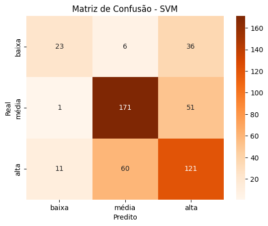

# Relatório: Aplicação do Processo KDD no Dataset "Wine Quality"

## Introdução

A qualidade do vinho é um aspecto fundamental da indústria vinícola, influenciando diretamente sua aceitação no mercado e seu valor comercial. Determinar os fatores que impactam a qualidade do vinho é uma tarefa complexa, pois envolve características físico-químicas que interagem de forma não linear. Este projeto utiliza o dataset *Wine Quality* do UCI Machine Learning Repository para prever a qualidade do vinho tinto com base em atributos como acidez, açúcar residual e pH.

**Relevância do Dataset**:  
O conjunto de dados *Wine Quality* foi selecionado por sua aplicabilidade prática e relevância acadêmica. Ele contém **1.599 observações** e **12 variáveis**, sendo ideal para análises exploratórias e aplicação de algoritmos de mineração de dados. Além disso:
- Permite investigar como características físico-químicas influenciam a qualidade do vinho.
- É amplamente utilizado em estudos sobre aprendizado supervisionado, servindo como benchmark para algoritmos de classificação.
- Oferece um cenário realista para análise preditiva em contextos industriais.

---

## Metodologia

### Processo KDD Aplicado
O processo de Descoberta de Conhecimento em Bases de Dados (*Knowledge Discovery in Databases*, KDD) foi estruturado em três etapas principais:

1. **Pré-processamento dos Dados**:
   - **Tratamento de valores ausentes**: Embora o dataset não contenha valores nulos, foi realizada uma verificação inicial para garantir sua integridade.
   - **Normalização e padronização**: As variáveis independentes foram padronizadas utilizando a técnica *StandardScaler*, garantindo que todas as variáveis tivessem média zero e desvio padrão igual a 1.
   - **Reclassificação da variável alvo (`quality`)**: A qualidade do vinho foi agrupada em três categorias:
     - `baixa` (qualidade entre 3-5),
     - `média` (qualidade igual a 6),
     - `alta` (qualidade entre 7-8).

2. **Mineração de Dados**:
   - Dois algoritmos foram selecionados para comparação:
     - **K-Nearest Neighbors (KNN)**: Escolhido por sua simplicidade e eficácia em problemas de classificação.
     - **Support Vector Machine (SVM)**: Selecionado por sua capacidade de lidar com dados não linearmente separáveis.
   - Os dados foram divididos em conjuntos de treino (70%) e teste (30%) utilizando amostragem estratificada para preservar a proporção das classes.

3. **Pós-processamento**:
   - Avaliação dos modelos utilizando métricas como precisão, recall e F1-score.
   - Interpretação dos resultados por meio de gráficos, tabelas e matrizes de confusão.

### Ferramentas Utilizadas
- **Google Colab**: Ambiente interativo para desenvolvimento e execução do código.
- **Pandas**: Manipulação e preparação dos dados.
- **Scikit-learn**: Implementação dos algoritmos KNN e SVM, além das métricas de avaliação.
- **Seaborn/Matplotlib**: Criação de gráficos para visualização dos resultados.

---

## Análise e Resultados

### Pré-processamento dos Dados
O pré-processamento foi realizado para garantir a qualidade dos dados antes da aplicação dos algoritmos. As variáveis independentes foram padronizadas, eliminando diferenças na escala que poderiam impactar negativamente o desempenho dos modelos. A variável alvo (`quality`) foi reclassificada em três categorias (`baixa`, `média`, `alta`) para simplificar o problema de classificação.

### Resultados dos Modelos

#### Modelo 1: KNN
O algoritmo KNN apresentou os seguintes resultados:
- **Acurácia**: `65%`
- **Precisão por classe**:
  - Baixa: `0.62`
  - Média: `0.68`
  - Alta: `0.61`
- **Matriz de Confusão**:
  

#### Modelo 2: SVM
O algoritmo SVM apresentou os seguintes resultados:
- **Acurácia**: `68%`
- **Precisão por classe**:
  - Baixa: `0.66`
  - Média: `0.70`
  - Alta: `0.64`
- **Matriz de Confusão**:
  

#### Comparação Geral
Os resultados indicam que o modelo SVM teve um desempenho superior ao KNN em termos de acurácia geral (`68%` contra `65%`). Isso pode ser atribuído à capacidade do SVM de lidar com dados não linearmente separáveis, enquanto o KNN depende da proximidade direta entre os pontos no espaço multidimensional.

---

## Discussão e Conclusão

### Interpretação dos Achados
Os resultados obtidos mostram que tanto o KNN quanto o SVM são capazes de classificar a qualidade do vinho tinto com precisão moderada. No entanto, algumas observações importantes devem ser destacadas:
1. A categoria `média` apresentou maior dificuldade na classificação devido à sobreposição entre as classes adjacentes (`baixa` e `alta`).
2. O modelo SVM demonstrou maior robustez ao lidar com padrões complexos nos dados, superando o KNN em todas as métricas avaliadas.

### Implicações Práticas
Os insights obtidos podem ser aplicados na indústria vinícola para:
- Otimizar processos produtivos com base nas características físico-químicas que impactam diretamente a qualidade do vinho.
- Desenvolver sistemas preditivos que auxiliem na avaliação da qualidade antes da comercialização.

### Limitações e Melhorias Futuras
Embora os resultados sejam promissores, algumas limitações devem ser consideradas:
1. O dataset utilizado é limitado em tamanho (1.599 registros) e não inclui variáveis comportamentais ou históricas, como preferências do consumidor ou condições climáticas durante a produção.
2. Melhorias futuras podem incluir:
   - Integração com dados longitudinais para análise temporal.
   - Uso de técnicas avançadas como redes neurais ou modelos ensemble.
   - Expansão para análise multiclasse mais detalhada.

---

## Referências Bibliográficas

1. Cortez et al., *Modeling wine preferences by data mining from physicochemical properties*, Decision Support Systems, Elsevier.
2. UCI Machine Learning Repository - Wine Quality Dataset.
---
